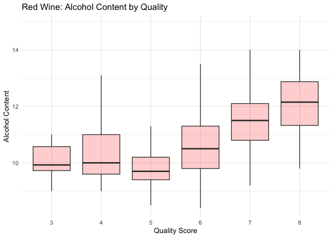
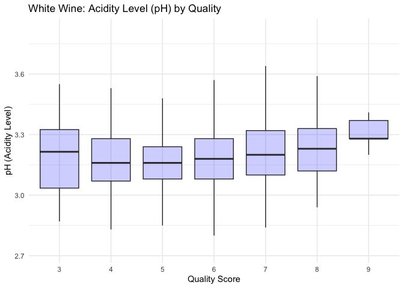

README
================

# Data Understanding

According to JJ Buckley Fine Wines, there are four indicators of wine
quality: complexity, balance, typicity, and intensity and finish.

Complexity: Higher quality wines are more complex in their flavor
profile. They often have numerous layers that release flavors over time.

Balance: Wines that have good balance will be of higher quality than
ones where one component stands out above the rest. The five components
– acidity, tannins, sugar/sweetness, alcohol and fruit – need to be
balanced.Higher quality wines don’t necessarily need moderation in each
component – indeed, some red wines have higher acidity while others have
a higher alcohol content. The dataset contains pH and Residual sugar
variables, which contribute to the balance of the overall wine taste and
impacts the quality.

Typicity: This is how much the wine looks and tastes the way it should.
For example, red Burgundy should have a certain appearance and taste,
and it’s this combination that wine connoisseurs look for with each new
vintage. This is not really tested in the analysis.

Intensity and Finish: High-quality wines will express intense flavors
and a lingering finish, with flavors lasting after you’ve swallowed the
wine. Flavors that disappear immediately can indicate that your wine is
of moderate quality at best. The better the wine, the longer the flavor
finish will last on your palate. Examples of a lingering taste/finish
are indicated by alcohol content, which is tested for in the analysis.

Data source:
<https://www.jjbuckley.com/wine-knowledge/blog/the-4-factors-and-4-indicators-of-wine-quality/1009?srsltid=AfmBOoqSbpGwTLbqIFzrsPKPRth4ogICEdqOqLiY0C2fSBvxhPvW2cSo>

## Loading All Necessary Packages

``` r
library(knitr)
library(ggplot2)
library(dplyr)
```

    ## 
    ## Attaching package: 'dplyr'

    ## The following objects are masked from 'package:stats':
    ## 
    ##     filter, lag

    ## The following objects are masked from 'package:base':
    ## 
    ##     intersect, setdiff, setequal, union

``` r
library(corrplot)
```

    ## corrplot 0.95 loaded

``` r
library(tidyr)
library(ggpubr)
library(stats)
library(car)
```

    ## Loading required package: carData

    ## 
    ## Attaching package: 'car'

    ## The following object is masked from 'package:dplyr':
    ## 
    ##     recode

``` r
library(kableExtra)
```

    ## 
    ## Attaching package: 'kableExtra'

    ## The following object is masked from 'package:dplyr':
    ## 
    ##     group_rows

# Loading the Data

``` r
redwine <- read.csv("wine_data/winequality-red.csv", header = TRUE, sep = ";")
whitewine <- read.csv("wine_data/winequality-white.csv", header = TRUE, sep = ";")
```

``` r
kable(dataset_info, caption = "Table 1. Number of Samples and Features in the Wine Datasets")
```

| Dataset    | Samples | Features |
|:-----------|--------:|---------:|
| Red Wine   |    1599 |       12 |
| White Wine |    4898 |       12 |

Table 1. Number of Samples and Features in the Wine Datasets

``` r
# Display the table nicely
kable(feature_info, caption = "Table 2. Feature Descriptions for Red and White Wine")
```

| Feature              | Description                        | Scale_Type |
|:---------------------|:-----------------------------------|:-----------|
| Fixed Acidity        | Non-volatile acids                 | Ratio      |
| Volatile Acidity     | Acetic acid                        | Ratio      |
| Citric Acid          | Adds freshness                     | Ratio      |
| Residual Sugar       | Leftover sugar after fermentation  | Ratio      |
| Chlorides            | Salt content in wine               | Ratio      |
| Free Sulfur Dioxide  | SO2 that prevents microbial growth | Ratio      |
| Total Sulfur Dioxide | Total SO2 (free + bound)           | Ratio      |
| Density              | Mass per unit volume of wine       | Ratio      |
| pH                   | Acidity level of the wine          | Interval   |
| Sulphates            | Contributes to wine stability      | Ratio      |
| Alcohol              | Percentage of alcohol content      | Ratio      |
| Quality              | Wine quality score rated from 0–10 | Ordinal    |

Table 2. Feature Descriptions for Red and White Wine

This table displays the features for both the red wine and white wine
datasets. Listed are the variables in the dataset, the description for
each variable, and the data type.

# EDA

## Summary Statistics for Red and White Wine

``` r
get_summary_stats <- function(data) {
  data %>%
    select(where(is.numeric), -Quality) %>%  # Exclude 'Quality' from numeric selection
    summarise(across(
      everything(),
      list(
        Count = ~sum(!is.na(.)),
        Mean = ~mean(., na.rm = TRUE),
        Median = ~median(., na.rm = TRUE),
        SD = ~sd(., na.rm = TRUE),
        Min = ~min(., na.rm = TRUE),
        Max = ~max(., na.rm = TRUE)
      ),
      .names = "{.col}_{.fn}"
    )) %>%
    pivot_longer(everything(),
                 names_to = c("Variable", "Statistic"),
                 names_sep = "_",
                 values_to = "Value") %>%
    pivot_wider(names_from = Statistic, values_from = Value)
}

# Red Wine Summary Table
summary_redwine <- get_summary_stats(redwine)

kable(summary_redwine, caption = "Table 3: Detailed Summary Statistics for Red Wine") %>%
  kable_styling(bootstrap_options = c("striped", "hover"), full_width = FALSE)
```

<table class="table table-striped table-hover" style="width: auto !important; margin-left: auto; margin-right: auto;">
<caption>
Table 3: Detailed Summary Statistics for Red Wine
</caption>
<thead>
<tr>
<th style="text-align:left;">
Variable
</th>
<th style="text-align:right;">
Count
</th>
<th style="text-align:right;">
Mean
</th>
<th style="text-align:right;">
Median
</th>
<th style="text-align:right;">
SD
</th>
<th style="text-align:right;">
Min
</th>
<th style="text-align:right;">
Max
</th>
</tr>
</thead>
<tbody>
<tr>
<td style="text-align:left;">
Fixed Acidity
</td>
<td style="text-align:right;">
1599
</td>
<td style="text-align:right;">
8.3196373
</td>
<td style="text-align:right;">
7.90000
</td>
<td style="text-align:right;">
1.7410963
</td>
<td style="text-align:right;">
4.60000
</td>
<td style="text-align:right;">
15.90000
</td>
</tr>
<tr>
<td style="text-align:left;">
Volatile Acidity
</td>
<td style="text-align:right;">
1599
</td>
<td style="text-align:right;">
0.5278205
</td>
<td style="text-align:right;">
0.52000
</td>
<td style="text-align:right;">
0.1790597
</td>
<td style="text-align:right;">
0.12000
</td>
<td style="text-align:right;">
1.58000
</td>
</tr>
<tr>
<td style="text-align:left;">
Citric Acid
</td>
<td style="text-align:right;">
1599
</td>
<td style="text-align:right;">
0.2709756
</td>
<td style="text-align:right;">
0.26000
</td>
<td style="text-align:right;">
0.1948011
</td>
<td style="text-align:right;">
0.00000
</td>
<td style="text-align:right;">
1.00000
</td>
</tr>
<tr>
<td style="text-align:left;">
Residual Sugar
</td>
<td style="text-align:right;">
1599
</td>
<td style="text-align:right;">
2.5388055
</td>
<td style="text-align:right;">
2.20000
</td>
<td style="text-align:right;">
1.4099281
</td>
<td style="text-align:right;">
0.90000
</td>
<td style="text-align:right;">
15.50000
</td>
</tr>
<tr>
<td style="text-align:left;">
Chlorides
</td>
<td style="text-align:right;">
1599
</td>
<td style="text-align:right;">
0.0874665
</td>
<td style="text-align:right;">
0.07900
</td>
<td style="text-align:right;">
0.0470653
</td>
<td style="text-align:right;">
0.01200
</td>
<td style="text-align:right;">
0.61100
</td>
</tr>
<tr>
<td style="text-align:left;">
Free Sulfur Dioxide
</td>
<td style="text-align:right;">
1599
</td>
<td style="text-align:right;">
15.8749218
</td>
<td style="text-align:right;">
14.00000
</td>
<td style="text-align:right;">
10.4601570
</td>
<td style="text-align:right;">
1.00000
</td>
<td style="text-align:right;">
72.00000
</td>
</tr>
<tr>
<td style="text-align:left;">
Total Sulfur Dioxide
</td>
<td style="text-align:right;">
1599
</td>
<td style="text-align:right;">
46.4677924
</td>
<td style="text-align:right;">
38.00000
</td>
<td style="text-align:right;">
32.8953245
</td>
<td style="text-align:right;">
6.00000
</td>
<td style="text-align:right;">
289.00000
</td>
</tr>
<tr>
<td style="text-align:left;">
Density
</td>
<td style="text-align:right;">
1599
</td>
<td style="text-align:right;">
0.9967467
</td>
<td style="text-align:right;">
0.99675
</td>
<td style="text-align:right;">
0.0018873
</td>
<td style="text-align:right;">
0.99007
</td>
<td style="text-align:right;">
1.00369
</td>
</tr>
<tr>
<td style="text-align:left;">
pH
</td>
<td style="text-align:right;">
1599
</td>
<td style="text-align:right;">
3.3111132
</td>
<td style="text-align:right;">
3.31000
</td>
<td style="text-align:right;">
0.1543865
</td>
<td style="text-align:right;">
2.74000
</td>
<td style="text-align:right;">
4.01000
</td>
</tr>
<tr>
<td style="text-align:left;">
Sulphates
</td>
<td style="text-align:right;">
1599
</td>
<td style="text-align:right;">
0.6581488
</td>
<td style="text-align:right;">
0.62000
</td>
<td style="text-align:right;">
0.1695070
</td>
<td style="text-align:right;">
0.33000
</td>
<td style="text-align:right;">
2.00000
</td>
</tr>
<tr>
<td style="text-align:left;">
Alcohol
</td>
<td style="text-align:right;">
1599
</td>
<td style="text-align:right;">
10.4229831
</td>
<td style="text-align:right;">
10.20000
</td>
<td style="text-align:right;">
1.0656676
</td>
<td style="text-align:right;">
8.40000
</td>
<td style="text-align:right;">
14.90000
</td>
</tr>
</tbody>
</table>

``` r
# White Wine Summary Table
summary_whitewine <- get_summary_stats(whitewine)

kable(summary_whitewine, caption = "Table 4: Detailed Summary Statistics for White Wine") %>%
  kable_styling(bootstrap_options = c("striped", "hover"), full_width = FALSE)
```

<table class="table table-striped table-hover" style="width: auto !important; margin-left: auto; margin-right: auto;">
<caption>
Table 4: Detailed Summary Statistics for White Wine
</caption>
<thead>
<tr>
<th style="text-align:left;">
Variable
</th>
<th style="text-align:right;">
Count
</th>
<th style="text-align:right;">
Mean
</th>
<th style="text-align:right;">
Median
</th>
<th style="text-align:right;">
SD
</th>
<th style="text-align:right;">
Min
</th>
<th style="text-align:right;">
Max
</th>
</tr>
</thead>
<tbody>
<tr>
<td style="text-align:left;">
Fixed Acidity
</td>
<td style="text-align:right;">
4898
</td>
<td style="text-align:right;">
6.8547877
</td>
<td style="text-align:right;">
6.80000
</td>
<td style="text-align:right;">
0.8438682
</td>
<td style="text-align:right;">
3.80000
</td>
<td style="text-align:right;">
14.20000
</td>
</tr>
<tr>
<td style="text-align:left;">
Volatile Acidity
</td>
<td style="text-align:right;">
4898
</td>
<td style="text-align:right;">
0.2782411
</td>
<td style="text-align:right;">
0.26000
</td>
<td style="text-align:right;">
0.1007945
</td>
<td style="text-align:right;">
0.08000
</td>
<td style="text-align:right;">
1.10000
</td>
</tr>
<tr>
<td style="text-align:left;">
Citric Acid
</td>
<td style="text-align:right;">
4898
</td>
<td style="text-align:right;">
0.3341915
</td>
<td style="text-align:right;">
0.32000
</td>
<td style="text-align:right;">
0.1210198
</td>
<td style="text-align:right;">
0.00000
</td>
<td style="text-align:right;">
1.66000
</td>
</tr>
<tr>
<td style="text-align:left;">
Residual Sugar
</td>
<td style="text-align:right;">
4898
</td>
<td style="text-align:right;">
6.3914149
</td>
<td style="text-align:right;">
5.20000
</td>
<td style="text-align:right;">
5.0720578
</td>
<td style="text-align:right;">
0.60000
</td>
<td style="text-align:right;">
65.80000
</td>
</tr>
<tr>
<td style="text-align:left;">
Chlorides
</td>
<td style="text-align:right;">
4898
</td>
<td style="text-align:right;">
0.0457724
</td>
<td style="text-align:right;">
0.04300
</td>
<td style="text-align:right;">
0.0218480
</td>
<td style="text-align:right;">
0.00900
</td>
<td style="text-align:right;">
0.34600
</td>
</tr>
<tr>
<td style="text-align:left;">
Free Sulfur Dioxide
</td>
<td style="text-align:right;">
4898
</td>
<td style="text-align:right;">
35.3080849
</td>
<td style="text-align:right;">
34.00000
</td>
<td style="text-align:right;">
17.0071373
</td>
<td style="text-align:right;">
2.00000
</td>
<td style="text-align:right;">
289.00000
</td>
</tr>
<tr>
<td style="text-align:left;">
Total Sulfur Dioxide
</td>
<td style="text-align:right;">
4898
</td>
<td style="text-align:right;">
138.3606574
</td>
<td style="text-align:right;">
134.00000
</td>
<td style="text-align:right;">
42.4980646
</td>
<td style="text-align:right;">
9.00000
</td>
<td style="text-align:right;">
440.00000
</td>
</tr>
<tr>
<td style="text-align:left;">
Density
</td>
<td style="text-align:right;">
4898
</td>
<td style="text-align:right;">
0.9940274
</td>
<td style="text-align:right;">
0.99374
</td>
<td style="text-align:right;">
0.0029909
</td>
<td style="text-align:right;">
0.98711
</td>
<td style="text-align:right;">
1.03898
</td>
</tr>
<tr>
<td style="text-align:left;">
pH
</td>
<td style="text-align:right;">
4898
</td>
<td style="text-align:right;">
3.1882666
</td>
<td style="text-align:right;">
3.18000
</td>
<td style="text-align:right;">
0.1510006
</td>
<td style="text-align:right;">
2.72000
</td>
<td style="text-align:right;">
3.82000
</td>
</tr>
<tr>
<td style="text-align:left;">
Sulphates
</td>
<td style="text-align:right;">
4898
</td>
<td style="text-align:right;">
0.4898469
</td>
<td style="text-align:right;">
0.47000
</td>
<td style="text-align:right;">
0.1141258
</td>
<td style="text-align:right;">
0.22000
</td>
<td style="text-align:right;">
1.08000
</td>
</tr>
<tr>
<td style="text-align:left;">
Alcohol
</td>
<td style="text-align:right;">
4898
</td>
<td style="text-align:right;">
10.5142670
</td>
<td style="text-align:right;">
10.40000
</td>
<td style="text-align:right;">
1.2306206
</td>
<td style="text-align:right;">
8.00000
</td>
<td style="text-align:right;">
14.20000
</td>
</tr>
</tbody>
</table>

## Histograms

``` r
# Remove any NA or NaN values in the Alcohol column for both datasets
redwine_clean <- redwine[!is.na(redwine$Alcohol), ]
whitewine_clean <- whitewine[!is.na(whitewine$Alcohol), ]

# Remove outliers based on a reasonable range for Alcohol content (if necessary)
# You can set your own reasonable range based on domain knowledge; for example, alcohol content typically ranges from 8 to 15
redwine_clean <- redwine_clean[redwine_clean$Alcohol >= 8 & redwine_clean$Alcohol <= 15, ]
whitewine_clean <- whitewine_clean[whitewine_clean$Alcohol >= 8 & whitewine_clean$Alcohol <= 15, ]

# Calculate the histogram data for both red and white wine (without NAs and outliers)
hist_red <- hist(redwine_clean$Alcohol, plot = FALSE, breaks = "FD") # Freedman-Diaconis method to calculate breaks
hist_white <- hist(whitewine_clean$Alcohol, plot = FALSE, breaks = "FD") # Freedman-Diaconis method to calculate breaks

# Find the maximum frequency across both histograms
max_y <- max(max(hist_red$counts), max(hist_white$counts))

# Set a common binwidth for both histograms
binwidth_value <- 0.5

# Histogram for red wine alcohol content (after cleaning data)
ggplot(redwine_clean, aes(x = Alcohol)) +
  geom_histogram(binwidth = binwidth_value, fill = "#FF6961", color = "black") +
  theme_minimal() +
  labs(title = "Histogram of Alcohol Content for Red Wine", x = "Alcohol Content", y = "Frequency")
```

<!-- -->

``` r
# Histogram for white wine alcohol content (after cleaning data)
ggplot(whitewine_clean, aes(x = Alcohol)) +
  geom_histogram(binwidth = binwidth_value, fill = "#AEC6CF", color = "black") +
  theme_minimal() +
  labs(title = "Histogram of Alcohol Content for White Wine", x = "Alcohol Content", y = "Frequency")
```

<!-- -->

From the summary statistics calculated, there are more observations for
white wine than red wine, which is clear by the axis in the histograms
above. According to the histogram of the red wine, most red wines in the
dataset has a alcohol content of around 9% to 10%. The data is right
skewed. The white wine also shows that the most frequent alochol content
is between 9%-10%, but there is less variability in the data. The
histogram shows a constant downwards regression–as the the alochol
content increases, the amount of white wine in the dataset that has
higher alochol content decreases. This holds true for the red wine as
well.

## Boxplots

``` r
# Add a column to identify wine type
redwine_clean$Type <- "Red"
whitewine_clean$Type <- "White"

# Combine the datasets
wine_combined <- rbind(redwine_clean, whitewine_clean)

# Boxplot of Alcohol Content by Wine Type
ggplot(wine_combined, aes(x = Type, y = Alcohol, fill = Type)) +
  geom_boxplot(color = "black") +
  scale_fill_manual(values = c("Red" = "#FF6961", "White" = "#AEC6CF")) +
  theme_minimal() +
  labs(title = "Boxplot of Alcohol Content by Wine Type", x = "Wine Type", y = "Alcohol Content") +
  theme(legend.position = "none")
```

<!-- -->

While comparing the red wine and white wine alcohol contents, it is
clear that the average alocohol content for both is very similar. The
white wine shows a slightly higher mean alcohol content than red wine.
The red wine boxplot indicates that there are few outliers in the
dataset, meaning that some of the red wines have very high alcohol
content. There is a wider range of alcohol content in white wine than
there is in red wine.

``` r
# Make Quality a factor for clearer x-axis grouping
redwine_clean$Quality <- as.factor(redwine_clean$Quality)
whitewine_clean$Quality <- as.factor(whitewine_clean$Quality)

# Red Wine: Jitter plot for Alcohol vs. Quality
ggplot(redwine_clean, aes(x = Quality, y = Alcohol)) +
  geom_boxplot(outlier.shape = NA, alpha = 0.2, fill = "red") +
  theme_minimal() +
  labs(title = "Red Wine: Alcohol Content by Quality", x = "Quality Score", y = "Alcohol Content")
```

<!-- -->

``` r
# White Wine: Jitter plot for Alcohol vs. Quality
ggplot(whitewine_clean, aes(x = Quality, y = Alcohol)) +
  geom_boxplot(outlier.shape = NA, alpha = 0.2, fill = "blue") +
  theme_minimal() +
  labs(title = "White Wine: Alcohol Content by Quality", x = "Quality Score", y = "Alcohol Content")
```

<!-- -->

In both plots, there is a general positive association between alcohol
content and quality score—higher-quality wines tend to have slightly
higher alcohol levels on average. This trend is more pronounced in white
wines, where the spread of alcohol content increases steadily with
quality, and the median alcohol level is noticeably higher in quality
scores of 7 and above. In red wines, the relationship is also evident
but more subtle, with some overlap in alcohol levels across quality
scores. These visualizations suggest that alcohol content may be a
contributing factor in perceived wine quality, especially for white
wines, and could warrant further statistical testing to assess the
strength and significance of this relationship.

``` r
# Scatterplot for Red Wine: pH vs Quality
ggplot(redwine_clean, aes(x = Quality, y = pH)) +
  geom_boxplot(outlier.shape = NA, alpha = 0.2, fill = "red") +
  theme_minimal() +
  labs(title = "Red Wine: Acidity Level (pH) by Quality", x = "Quality Score", y = "pH (Acidity Level)")
```

<!-- -->

``` r
# Scatterplot for White Wine: pH vs Quality
ggplot(whitewine_clean, aes(x = Quality, y = pH)) +
  geom_boxplot(outlier.shape = NA, alpha = 0.2, fill = "blue") +
  theme_minimal() +
  labs(title = "White Wine: Acidity Level (pH) by Quality", x = "Quality Score", y = "pH (Acidity Level)")
```

<!-- -->

The boxplots of acidity level (pH) by quality for both red and white
wines reveal only modest differences in acidity across varying quality
scores. For red wine, the pH values generally cluster around 3.2 to 3.4,
regardless of quality, suggesting that acidity does not vary drastically
with wine quality. However, there is a slight tendency for higher
quality red wines (scores of 7 and 8) to exhibit slightly lower pH
values, indicating marginally higher acidity. For white wine, the
pattern is similar: pH values mostly fall between 3.0 and 3.2 across all
quality levels. While the white wine appears to have slightly higher
acidity on average (lower pH), the distribution remains relatively
consistent across quality scores. Overall, the visualizations suggest
that while acidity is an important component of wine, it may not be a
primary driver of quality ratings in either red or white wine based on
this dataset.

``` r
# Make sure Quality is a factor for plotting
redwine$Quality <- as.factor(redwine$Quality)

ggplot(redwine, aes(x = Quality, y = `Residual Sugar`)) +
  geom_boxplot(outlier.shape = NA, alpha = 0.2, fill = "red") +
  theme_minimal() +
  labs(title = "Red Wine: Residual Sugar by Quality",
       x = "Quality Score",
       y = "Residual Sugar (g/dm³)")
```

<!-- -->

``` r
# Make sure Quality is a factor
whitewine$Quality <- as.factor(whitewine$Quality)

ggplot(whitewine, aes(x = Quality, y = `Residual Sugar`)) +
  geom_boxplot(outlier.shape = NA, alpha = 0.2, fill = "blue") +
  theme_minimal() +
  labs(title = "White Wine: Residual Sugar by Quality",
       x = "Quality Score",
       y = "Residual Sugar (g/dm³)")
```

<!-- -->

In red wine, residual sugar levels appear relatively consistent across
quality scores, with medians and interquartile ranges remaining narrow
and similar. While the median values remain relatively low, the spread
of the data increases, and several outliers with very high sugar content
appear—especially among wines rated with lower quality scores. This
suggests that for white wines, higher residual sugar may sometimes be
associated with lower perceived quality, although the relationship is
not strictly linear. Overall, the visualizations indicate that residual
sugar plays a more dynamic role in white wines than in red wines when it
comes to perceived quality.

## Correlation Tests

``` r
# Print the table using kable for a clean output
kable(cor_results, format = "html", caption = "Pearson Correlation Test Results for Red and White Wine", align = "lcccccc") %>%
  kable_styling(bootstrap_options = c("striped", "hover"))
```

<table class="table table-striped table-hover" style="margin-left: auto; margin-right: auto;">
<caption>
Pearson Correlation Test Results for Red and White Wine
</caption>
<thead>
<tr>
<th style="text-align:left;">
Test
</th>
<th style="text-align:center;">
Correlation_Coefficient
</th>
<th style="text-align:center;">
P_Value
</th>
<th style="text-align:center;">
Lower_Confidence_Interval
</th>
<th style="text-align:center;">
Upper_Confidence_Interval
</th>
</tr>
</thead>
<tbody>
<tr>
<td style="text-align:left;">
Red Wine: Alcohol vs Quality
</td>
<td style="text-align:center;">
0.4761663
</td>
<td style="text-align:center;">
0.0000000
</td>
<td style="text-align:center;">
0.4373540
</td>
<td style="text-align:center;">
0.5132081
</td>
</tr>
<tr>
<td style="text-align:left;">
White Wine: Alcohol vs Quality
</td>
<td style="text-align:center;">
0.4355747
</td>
<td style="text-align:center;">
0.0000000
</td>
<td style="text-align:center;">
0.4126015
</td>
<td style="text-align:center;">
0.4579941
</td>
</tr>
<tr>
<td style="text-align:left;">
Red Wine: pH vs Quality
</td>
<td style="text-align:center;">
-0.0577314
</td>
<td style="text-align:center;">
0.0209628
</td>
<td style="text-align:center;">
-0.1064513
</td>
<td style="text-align:center;">
-0.0087350
</td>
</tr>
<tr>
<td style="text-align:left;">
White Wine: pH vs Quality
</td>
<td style="text-align:center;">
0.0994272
</td>
<td style="text-align:center;">
0.0000000
</td>
<td style="text-align:center;">
0.0716202
</td>
<td style="text-align:center;">
0.1270798
</td>
</tr>
<tr>
<td style="text-align:left;">
Red Wine: Residual Sugar vs Quality
</td>
<td style="text-align:center;">
0.0137316
</td>
<td style="text-align:center;">
0.5832180
</td>
<td style="text-align:center;">
-0.0353133
</td>
<td style="text-align:center;">
0.0627106
</td>
</tr>
<tr>
<td style="text-align:left;">
White Wine: Residual Sugar vs Quality
</td>
<td style="text-align:center;">
-0.0975768
</td>
<td style="text-align:center;">
0.0000000
</td>
<td style="text-align:center;">
-0.1252410
</td>
<td style="text-align:center;">
-0.0697610
</td>
</tr>
</tbody>
</table>

Summary of Key Findings:

Alcohol has a moderate positive correlation with quality for both red
and white wines, with statistically significant p-values.

pH has a weak negative correlation with quality in red wine, and a small
positive correlation in white wine, both statistically significant but
weak in magnitude.

Residual Sugar shows no significant correlation with quality in red
wine, but a weak negative correlation with quality in white wine, which
is statistically significant.

These results suggest that alcohol content tends to have a positive
impact on wine quality, while pH and residual sugar have weaker, more
variable effects depending on the type of wine.

``` r
## Hypothesis Test
# T-test to compare alcohol content between red and white wine
t_test_alcohol <- t.test(redwine$Alcohol, whitewine$Alcohol)
print(t_test_alcohol)
```

    ## 
    ##  Welch Two Sample t-test
    ## 
    ## data:  redwine$Alcohol and whitewine$Alcohol
    ## t = -2.859, df = 3100.5, p-value = 0.004278
    ## alternative hypothesis: true difference in means is not equal to 0
    ## 95 percent confidence interval:
    ##  -0.15388669 -0.02868117
    ## sample estimates:
    ## mean of x mean of y 
    ##  10.42298  10.51427

This is a Welch Two-Sample t-test. This version of the t-test is used
when the two samples (red wine and white wine alcohol contents) have
unequal variances or unequal sample sizes, which is more robust than the
standard t-test under these conditions.

Null Hypothesis (H₀): The mean alcohol content of red wine is equal to
the mean alcohol content of white wine.

Alternative Hypothesis (H₁): The mean alcohol content of red wine is not
equal to the mean alcohol content of white wine.

Results: There is a statistically significant difference in the alcohol
content between red and white wines. Specifically, white wines have a
slightly higher average alcohol content than red wines. The difference
is significant, as indicated by the p-value of 0.004278, which is less
than the usual significance level of 0.05.

## Assumption Tests

``` r
# Shapiro-Wilk normality test for red wine alcohol
shapiro_red <- shapiro.test(redwine$Alcohol)
print(shapiro_red)
```

    ## 
    ##  Shapiro-Wilk normality test
    ## 
    ## data:  redwine$Alcohol
    ## W = 0.92884, p-value < 2.2e-16

``` r
# Shapiro-Wilk normality test for white wine alcohol
shapiro_white <- shapiro.test(whitewine$Alcohol)
print(shapiro_white)
```

    ## 
    ##  Shapiro-Wilk normality test
    ## 
    ## data:  whitewine$Alcohol
    ## W = 0.9553, p-value < 2.2e-16

``` r
# Levene's test for homogeneity of variances between red and white wine alcohol content
levene_test <- leveneTest(Alcohol ~ factor(c(rep(1, nrow(redwine)), rep(2, nrow(whitewine)))), data = rbind(redwine, whitewine))
print(levene_test)
```

    ## Levene's Test for Homogeneity of Variance (center = median)
    ##         Df F value    Pr(>F)    
    ## group    1  72.785 < 2.2e-16 ***
    ##       6495                      
    ## ---
    ## Signif. codes:  0 '***' 0.001 '**' 0.01 '*' 0.05 '.' 0.1 ' ' 1

For both red wine and white wine alcohol content, the Shapiro-Wilk test
for normality shows highly significant results (p-value \< 2.2e-16),
indicating that both red and white wine alcohol content are not normally
distributed. The Shapiro-Wilk test assesses whether the data follows a
normal distribution, and the very small p-value suggests strong evidence
against normality.

The Levene’s test for homogeneity of variance, which tests whether the
variances of alcohol content in red and white wines are equal, yields a
significant result (p-value \< 2.2e-16). This means that the assumption
of equal variances between the two groups (red wine and white wine
alcohol content) is violated, and the variances are significantly
different.

Given the significant results from both tests, the data does not meet
the assumptions of normality and homogeneity of variance. This is why
the Welch t-test was used, as it does not require these assumptions to
be met and is more robust when dealing with unequal variances or
non-normal distributions. Despite the violations of these assumptions,
the Welch t-test still provides reliable results in this case.

``` r
# Shapiro-Wilk normality test for Residual Sugar
shapiro_red_sugar <- shapiro.test(redwine_clean$`Residual Sugar`)
shapiro_white_sugar <- shapiro.test(whitewine_clean$`Residual Sugar`)
```

``` r
kable(assumption_results, digits = 5, caption = "Combined Assumption Test Results for pH and Residual Sugar by Wine Type")
```

| Test          | Variable       | Wine_Type | Statistic | P_Value |
|:--------------|:---------------|:----------|----------:|--------:|
| Shapiro-Wilk  | pH             | Red       |   0.99349 | 0.00000 |
| Shapiro-Wilk  | pH             | White     |   0.98810 | 0.00000 |
| Shapiro-Wilk  | Residual Sugar | Red       |   0.56608 | 0.00000 |
| Shapiro-Wilk  | Residual Sugar | White     |   0.88457 | 0.00000 |
| Levene’s Test | pH             | Red       |   0.29780 | 0.91425 |
| Levene’s Test | pH             | White     |   7.95696 | 0.00000 |
| Levene’s Test | Residual Sugar | Red       |   1.00490 | 0.41328 |
| Levene’s Test | Residual Sugar | White     |  17.35636 | 0.00000 |

Combined Assumption Test Results for pH and Residual Sugar by Wine Type

1.  Shapiro-Wilk Test for Normality:

The Shapiro-Wilk test assesses whether the data follows a normal
distribution. A p-value less than 0.05 indicates that the variable does
not follow a normal distribution, while a p-value greater than 0.05
suggests the variable may follow a normal distribution.

All of the variables (pH and residual sugar for both red and white wine)
fail the normality test (p-value \< 0.05), suggesting that none of these
variables are normally distributed in either type of wine.

2.  Levene’s Test for Homogeneity of Variance:

Levene’s test assesses whether the variances between two or more groups
are equal. A p-value greater than 0.05 indicates that the variances
between the groups are equal (the assumption of homogeneity of variance
is met). A p-value less than 0.05 suggests unequal variances.

For red wine, the assumption of equal variances holds for both pH and
residual sugar (p-value \> 0.05).

For white wine, the assumption of equal variances is violated for both
pH and residual sugar (p-value \< 0.05).

``` r
# Create a dataframe with the Spearman correlation results
spearman_results <- data.frame(
  Wine_Type = c("Red", "White", "Red", "White"),
  Variable = c("pH", "pH", "Residual Sugar", "Residual Sugar"),
  Rho = c(-0.0437, 0.1094, 0.0320, -0.0821),
  P_Value = c(0.08085, 1.656e-14, 0.2002, 8.822e-09),
  Significance = c("Not Significant", "Significant", "Not Significant", "Significant")
)
kable(spearman_results, caption = "Spearman's Rank Correlation Results: Wine Quality vs. pH and Residual Sugar")
```

| Wine_Type | Variable       |     Rho | P_Value | Significance    |
|:----------|:---------------|--------:|--------:|:----------------|
| Red       | pH             | -0.0437 | 0.08085 | Not Significant |
| White     | pH             |  0.1094 | 0.00000 | Significant     |
| Red       | Residual Sugar |  0.0320 | 0.20020 | Not Significant |
| White     | Residual Sugar | -0.0821 | 0.00000 | Significant     |

Spearman’s Rank Correlation Results: Wine Quality vs. pH and Residual
Sugar

Since the distributions are not normal using Pearson correlation and the
assumptions are not met, a non-parametric test must be used.

Red wine:

pH vs Quality (p-value: 0.08085): There is a very weak negative
correlation between pH and wine quality for red wine, but it is not
statistically significant at the 0.05 level. This means we don’t have
enough evidence to suggest a meaningful monotonic relationship between
pH and quality in red wines.

Residual Sugar vs Quality (p-value: 0.2002): There is a very weak
positive correlation between residual sugar and quality for red wine,
and it is also not statistically significant. Again, there’s no strong
evidence of a consistent upward or downward trend between these two
variables.

White Wine:

pH vs Quality (p-value: 1.656e-14): There is a weak but statistically
significant positive correlation between pH and wine quality in white
wines. Although the effect size is small, the relationship is strong
enough to be considered meaningful due to the very low p-value.

Residual Sugar vs Quality (p-value: 8.822e-09): There is a weak but
statistically significant negative correlation, suggesting that as
residual sugar increases, white wine quality tends to slightly decrease.
The relationship is small but not likely due to random chance.
